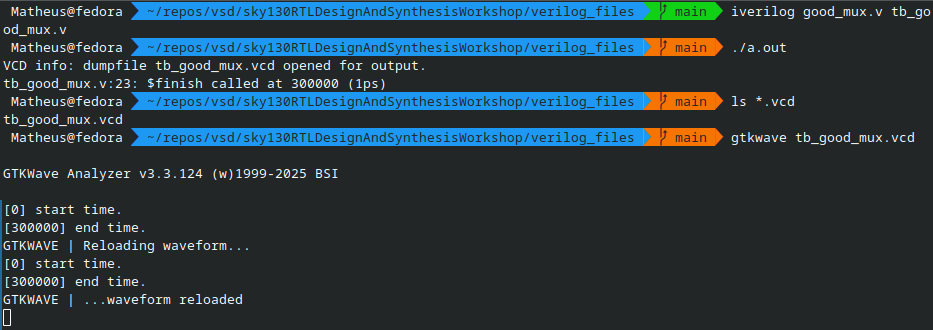
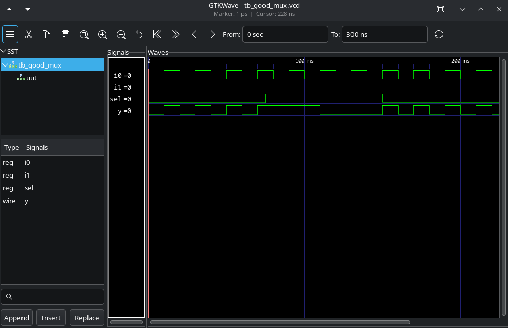

# Labs

## Lab01 - Setup for the activities

Firstly, it's necessary to install Iverilog, GTKWave and Yosys. In the Fedora Linux 41 (my distro), I ran this command:

```zsh
sudo dnf install iverilog gtkwave yosys
```

After that, we need to clone the repository with the lib, the design's and testbenches:

```zsh
git clone https://github.com/kunalg123/sky130RTLDesignAndSynthesisWorkshop
```

## Lab02 - Simulating a design

To simulate a design with Iverilog, run this command:

```zsh
iverilog <design> <testbench>
```

Where  <design> is the path/filename for the Verilog design file and <testbench> is the path/filename of the respective design test file.
It will produce a .out file, which when executed, produces a .vcd file. To load this VCD with GTKWave we run:

```zsh
gtkwave <vcd>
```

Where <vcd> is the path/filename for the VCD file.

To see the simulation output we click on the instance of the top level design and drag the signals to the wave panel. To better visualization, use the zoom to fit the signals.

## Example

On my pc, I simulate the good_mux.v design:



