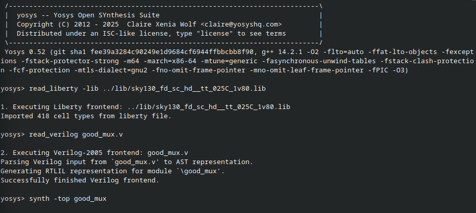
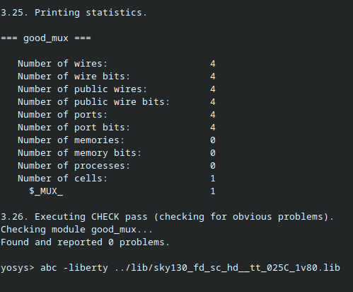
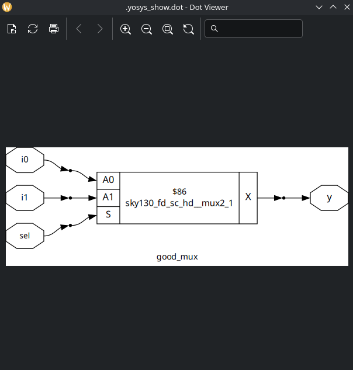
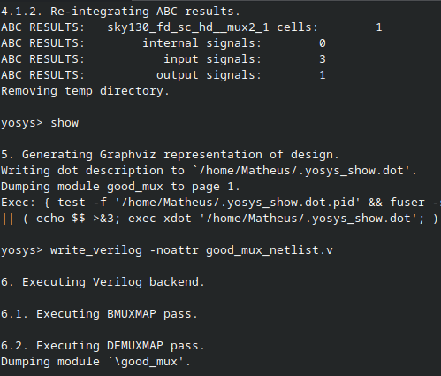

# Labs

## Lab03

On my pc, I did the whole synthesis process and checking for the 'good_mux.v' design:

1 Open yosys, read the library, read the design, synth the top level entity.

2 Map the cells.

3 Show the result.

4 Write the netlist.

## Como o Yosys Utiliza as Células (Exemplo do MUX)

A netlist gerada revela exatamente como o Yosys traduziu a lógica comportamental do MUX em uma estrutura de portas lógicas.

* **Lógica do MUX:** Um MUX 2 para 1 tem a equação `y = (a & ~sel) | (b & sel)`.
* **Implementação do Yosys:** Em vez de usar diretamente portas AND, OR e NOT, o Yosys (através do `abc`) otimiza a lógica para usar as células disponíveis da forma mais eficiente. No exemplo da aula, ele implementa a lógica do MUX usando:
    1. Um **inversor (`INV`)** para criar o sinal `sel_n` a partir da entrada `sel`.
    2. Duas portas **NAND**.
    3. Uma célula complexa chamada **OAI (OR-AND-INVERT)**, que implementa a função `NOT ( (A OR B) AND C )` em uma única célula, sendo mais eficiente que usar portas separadas.

Isso demonstra que a síntese não é uma tradução literal, mas um processo de otimização que seleciona a melhor combinação de células da biblioteca para implementar a função desejada.

## Como Ler e Entender uma Netlist Gerada

A netlist é um arquivo Verilog que descreve o circuito em nível estrutural. Aqui estão as chaves para entendê-la:

* **Declaração do Módulo:** O arquivo começa com a declaração do módulo, que terá as mesmas portas de entrada e saída do seu RTL original (ex: `module good_mux(i0, i1, sel, y);`).
* **Declaração de Fios (`wire`):** A netlist declara vários `wires` (fios) internos. Estes são os nós que conectam as saídas de umas portas às entradas de outras. O Yosys geralmente lhes dá nomes numéricos ou baseados nos nomes das células.
* **Instanciação de Células:** O corpo da netlist é uma lista de instanciações de células. Cada linha representa uma porta lógica do circuito. A sintaxe é:
    `nome_da_celula_da_biblioteca nome_da_instancia (.PORTA_A(fio_1), .PORTA_B(fio_2), .SAIDA(fio_3));`
    * **`nome_da_celula_da_biblioteca`:** O nome exato da célula conforme definido no arquivo `.lib` (ex: `sky130_fd_sc_hd__inv_2`).
    * **`nome_da_instancia`:** Um nome único para esta instância específica da célula (ex: `_001_`).
    * **`.PORTA(fio)`:** A conexão das portas da célula. Mostra qual `wire` (ou porta de entrada/saída do módulo) está conectado a cada pino da célula.

Ao seguir os fios de uma saída de uma célula para a entrada de outra, você pode traçar o caminho lógico completo e entender como a função do seu RTL foi fisicamente implementada pela ferramenta de síntese.
