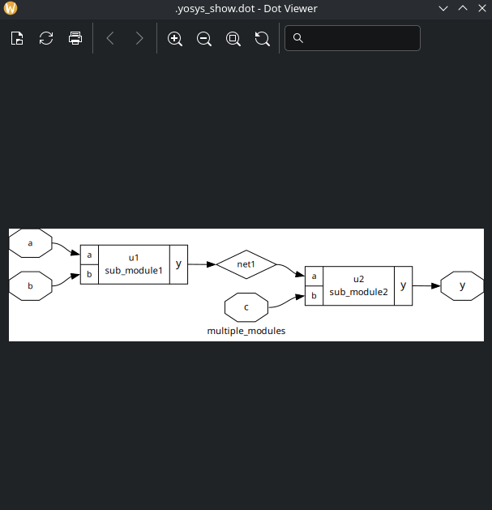
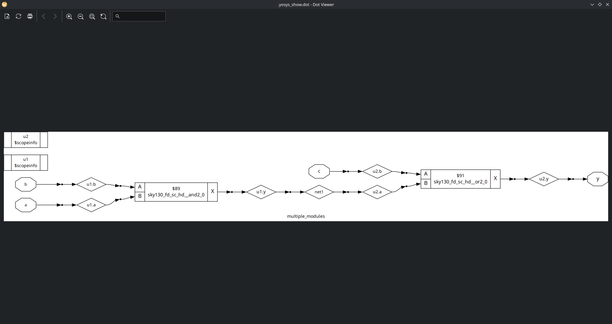
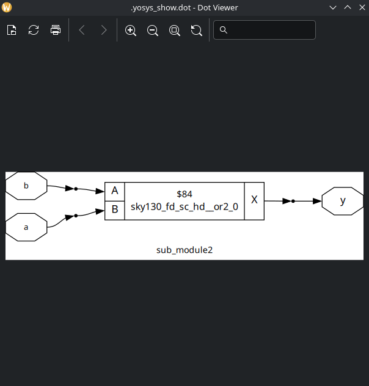

# Labs

## Lab 05

1. Synthesize multiple_modules.v normally, get hierarchical netlist.

2. Synthesize multiple_modules.v normally, execute `flatten` (before generating the netlist) command and get a flat netlist.

3. Synthesize submodule2 of multiple_modules.v.

