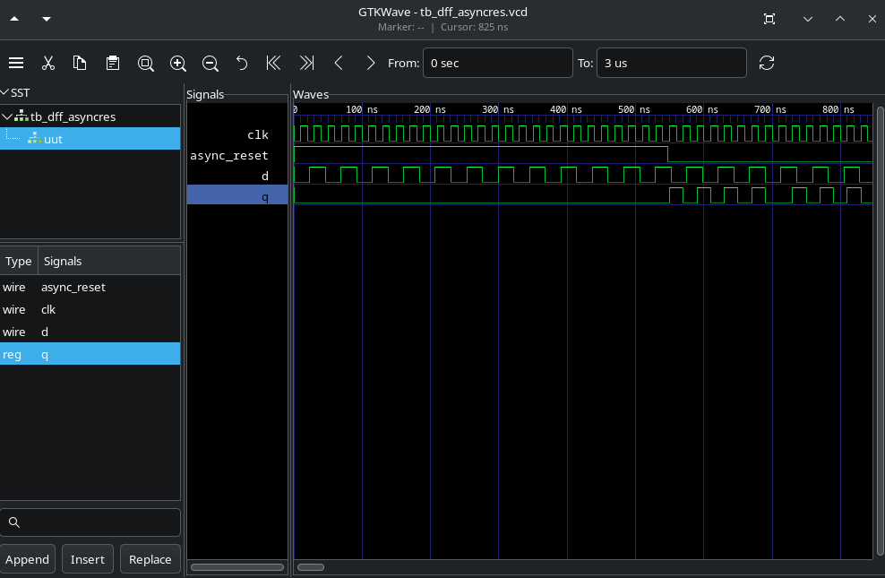
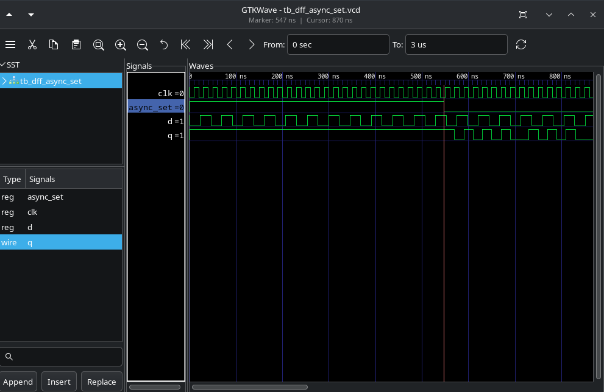
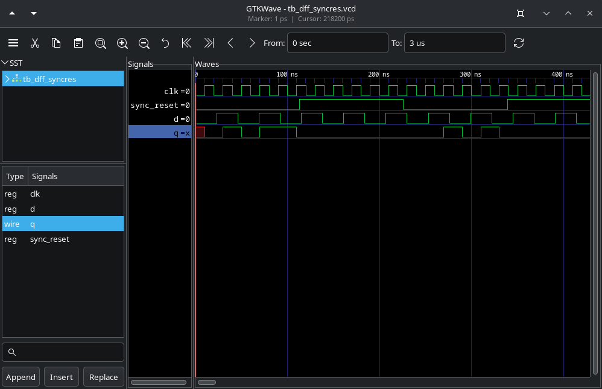
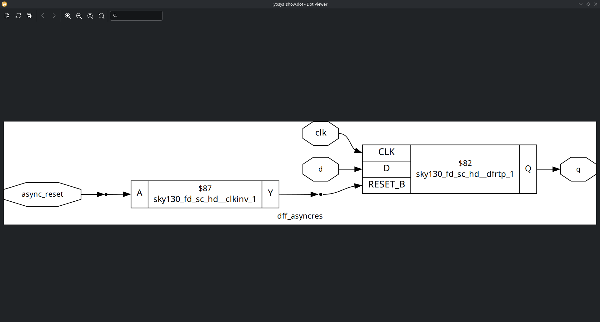
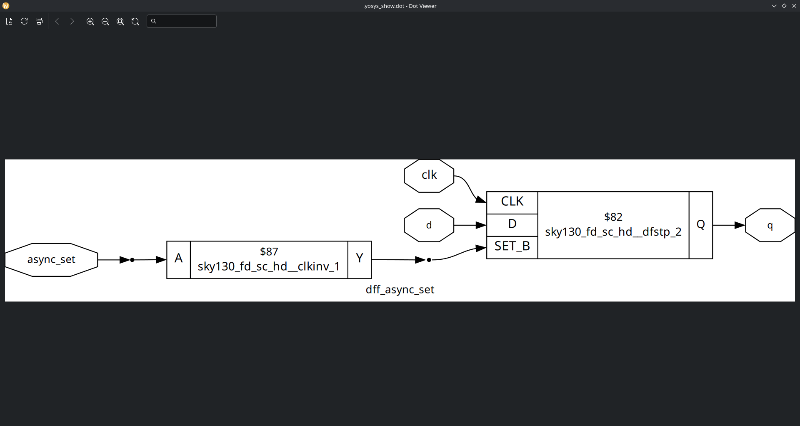
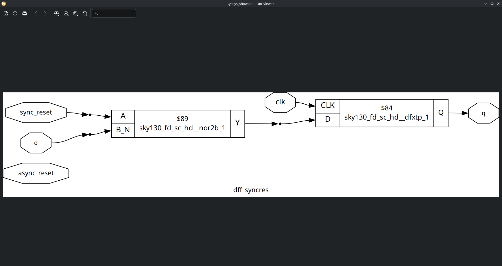

# Labs

# Lab 06

1. Simulate dff_async_res with iverilog and view the waveform with gtkwave:

2. Simulate dff_async_set:

3. Simulate dff sync res:

4. Synthesize dff_async_res with yosys. note: Run `dfflibmap -liberty <lib-path>` after `synth` to map the DFF cells to sequential cells of the lib (run `abc` normally after that).

5. Synthesize dff_async_set:

6. Synthesize dff_synC_res:

