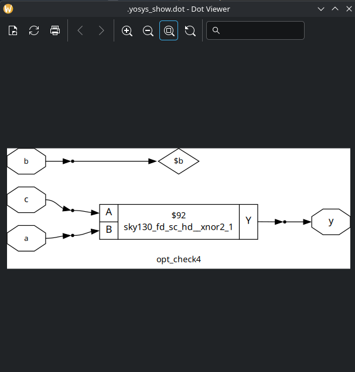
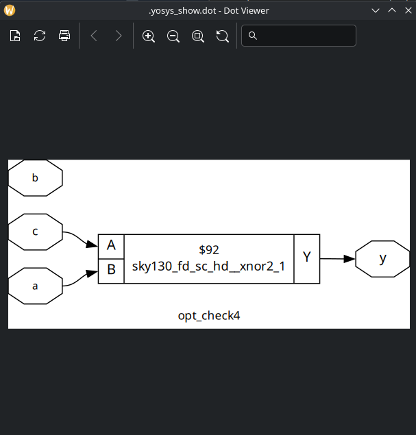
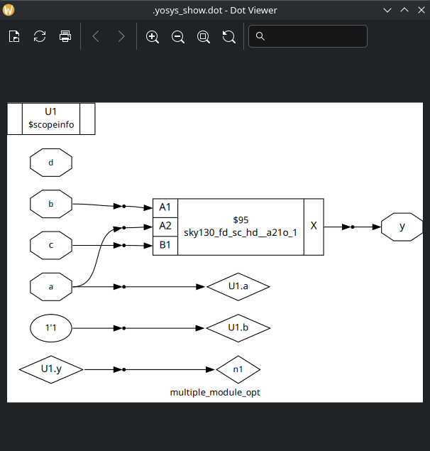
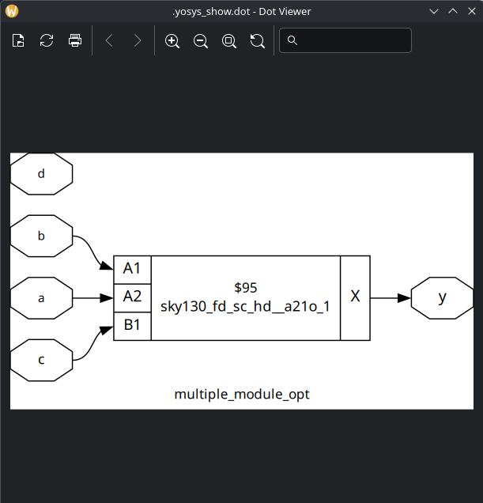
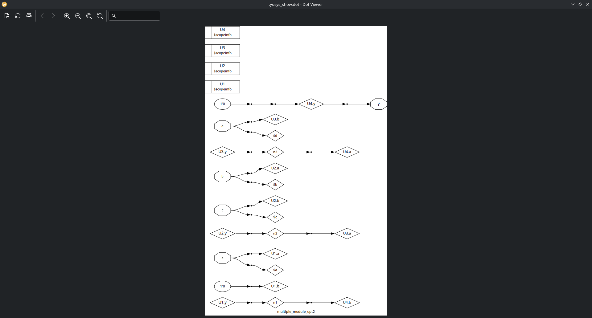
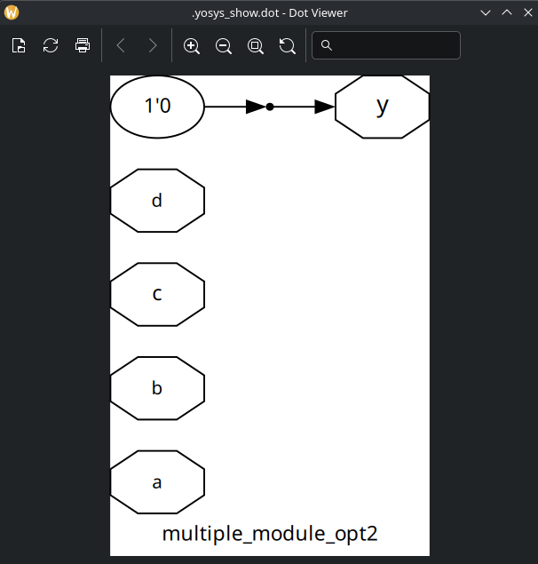

# Labs

## Lab 07

In this lab, I only did the exercises indicated by the instructor.

NOTE: The simplification indicated by the instructor in class is called "Absorption Law" of the Boolean Algebra.

NOTE: To optimize a design with submodules, it's necessary to `flatten` the design before run `opt_clean -purge`.

1. opt_check4.v netlist before optimization:

   After optimization:

2. multiple_module_opt.v netlist (flat) before optimization:

   After optimization:

3. multiple_module_opt2.v netlist (flat) before optimization:

   After optimization:

