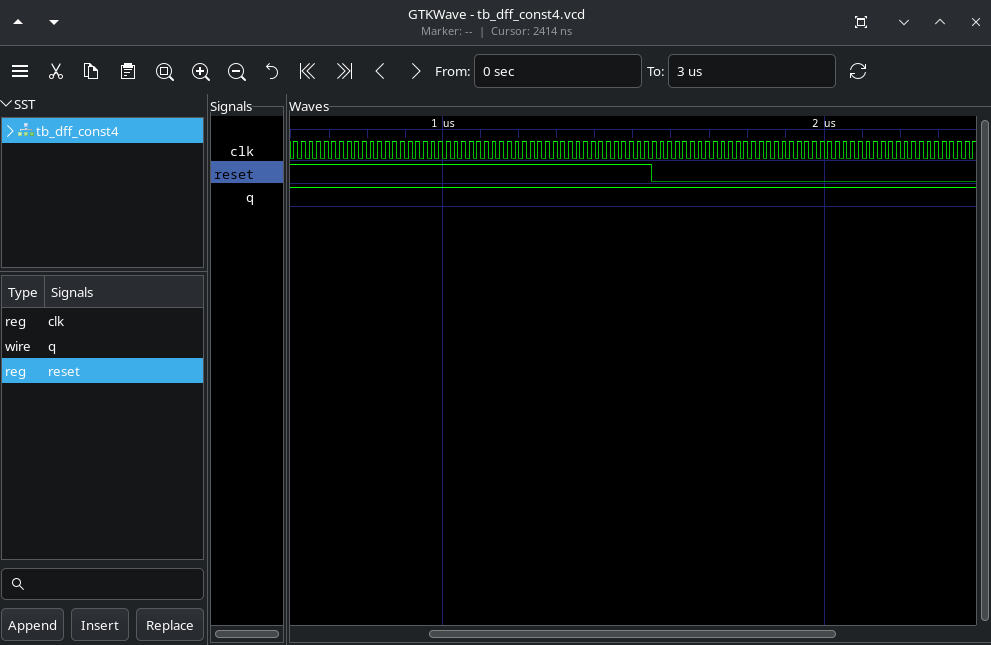
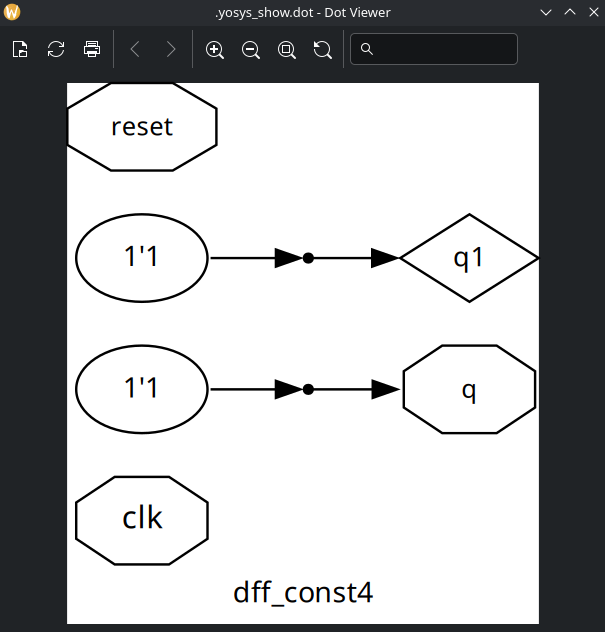
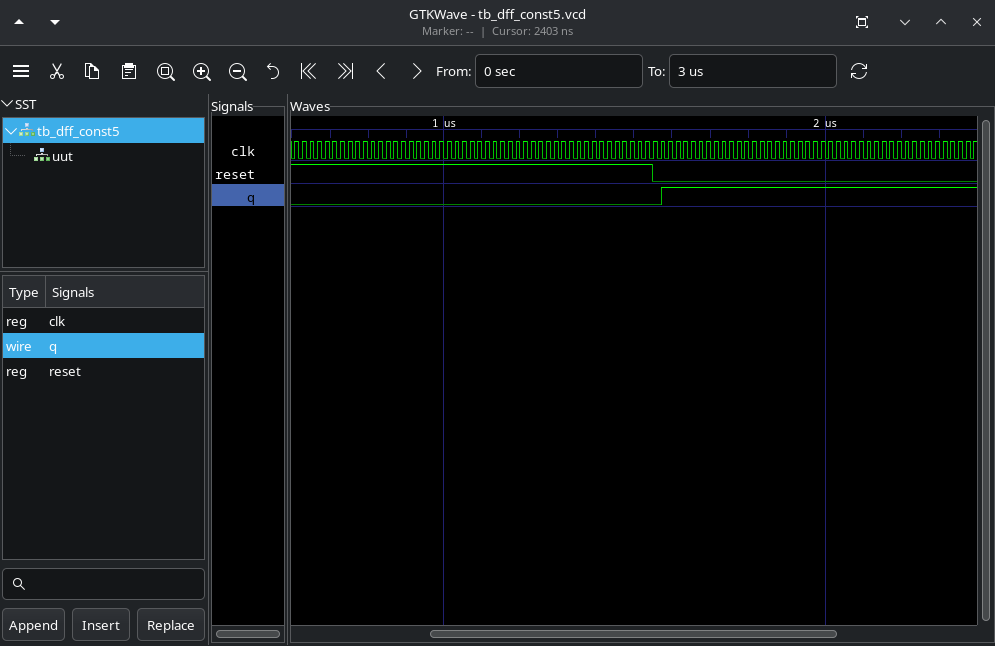
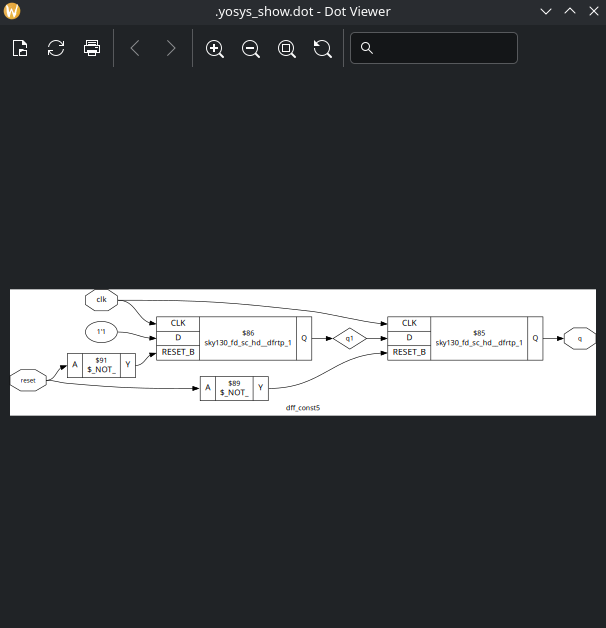

# Labs

## Lab 08

In this lab, I only did the exercises indicated by the instructor.

1. dff_const4.v waveform in gtkwave:

   In the simulation, the output 'q' is constant independent of 'clk' and 'reset'.
   We should see only a wire connecting 'q' to a 1 bit (high) in the netlist.
   dff_const4.v netlist obtained:

2. dff_const5.v waveform in gtkwave:

   In the simulation, the output 'q' is NOT constant, therefore, there should not be many optimizations to be made in the synthesis
   dff_const5.v netlist obtained:

