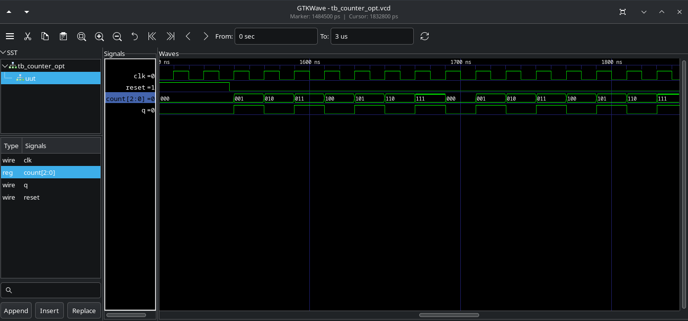
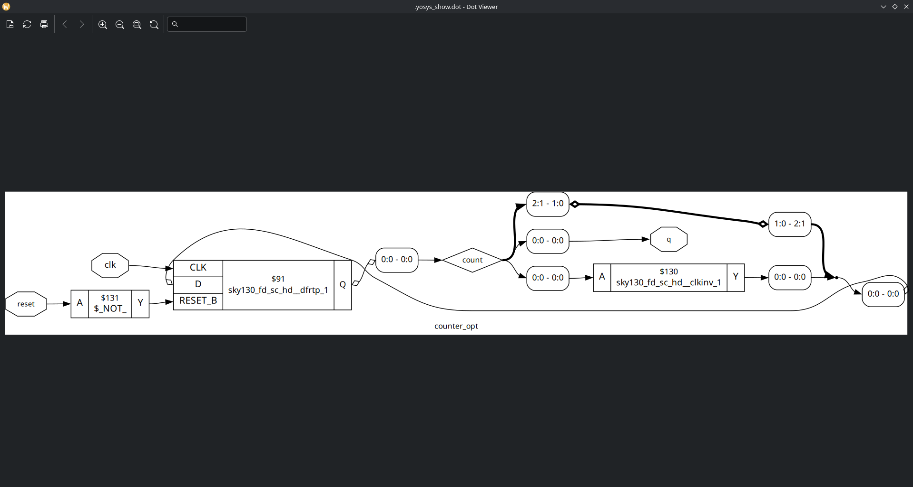
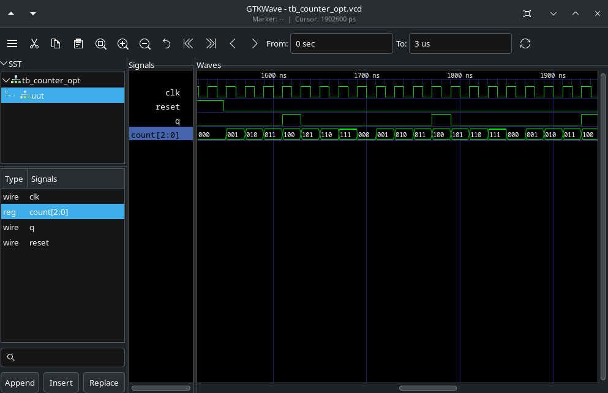
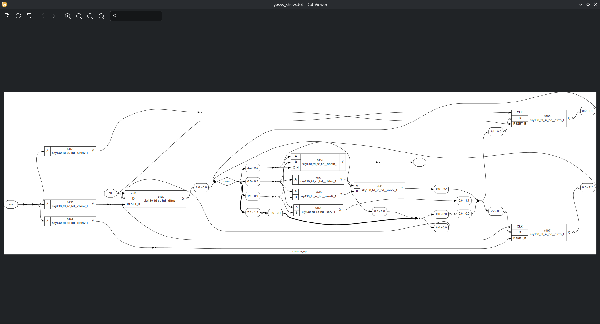

# Labs

## Lab 09

In this lab, as there were no exercises, I repeated the examples from the class.

1. Simulate and synth counter_opt.v

   As we saw in class, 'q' logic is only dependent to the [0] bit, therefore, will only one dff in the netlist.

2. Simulate and synth counter_opt.v with 'assign q = (count[2:0] == 3'b100)' line modified.

   Now, 'q' logic is dependent of all count bits, therefore, will be three dff (and a combinational logic) in the netlist.

