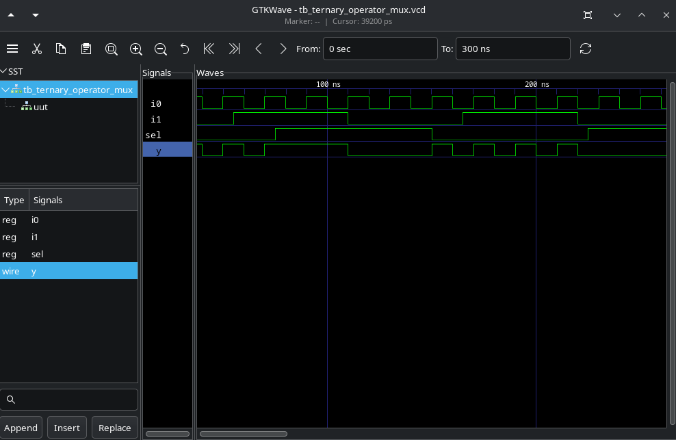
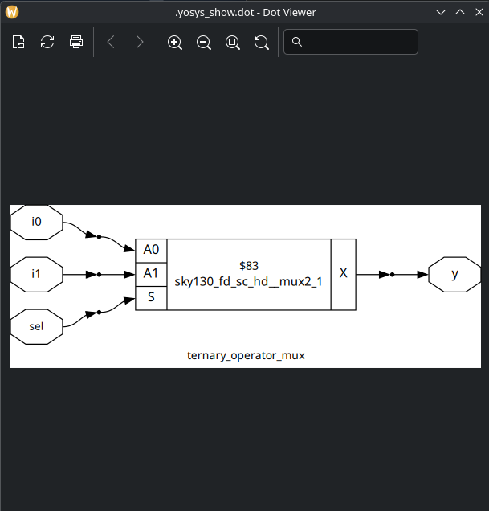
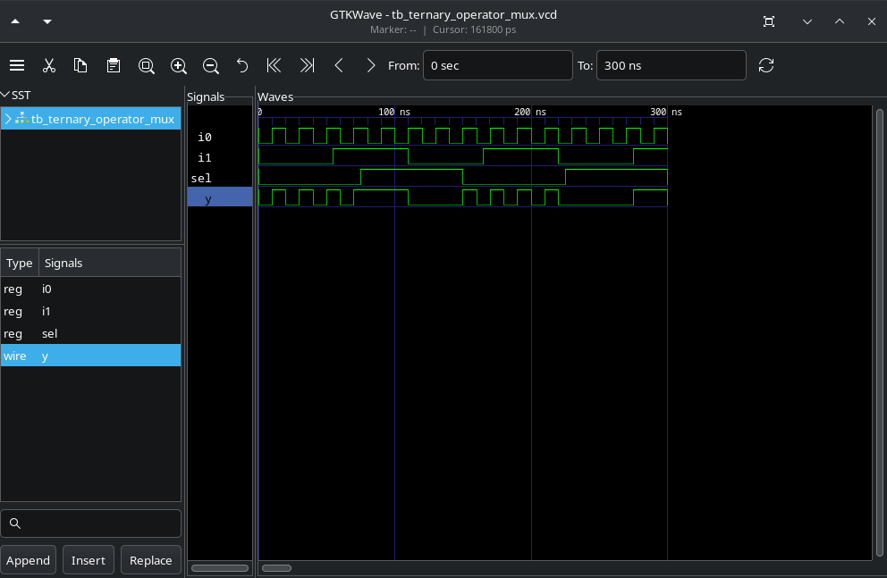
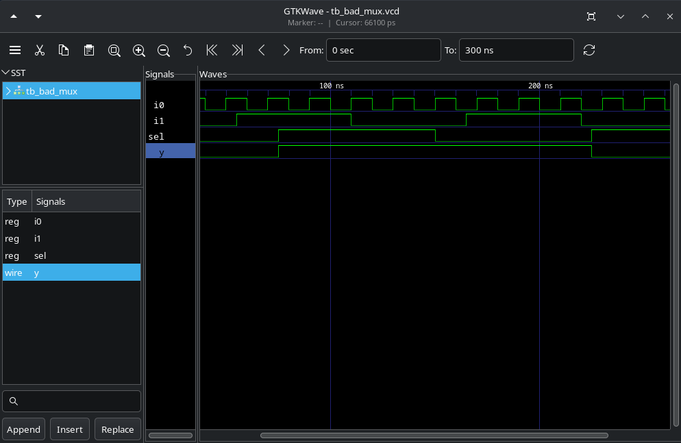
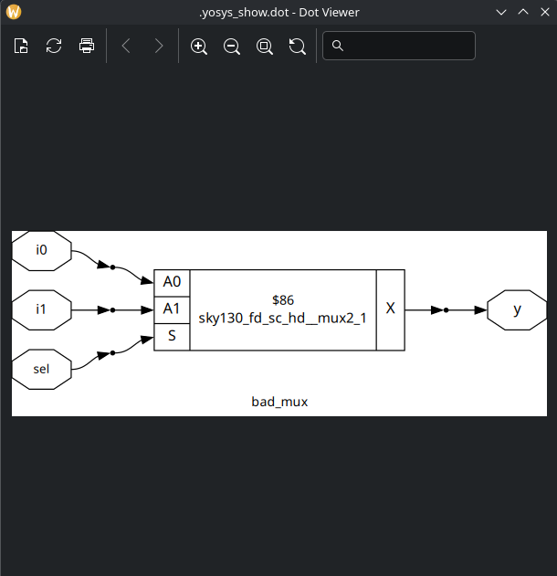
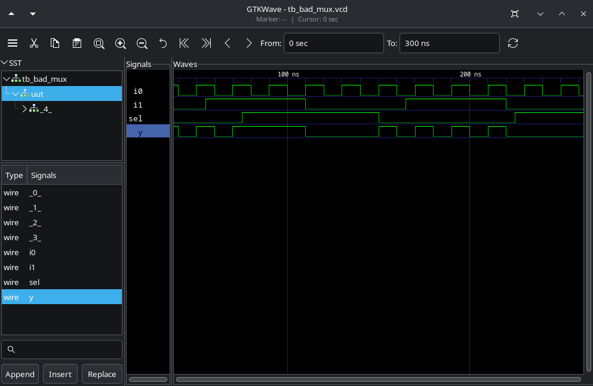

# Labs

## Labs10

In this lab, as there were no exercises, I repeated the examples from the class.

1.Simulate ternary_operator.v.

2.Synthesize ternary_operator.v (write the netlist).

3.Perform GLS simualation. NOTE: To run simulate the netlist it's necessary to include `../my_lib/verilog_model/primitives.v` and `../my_lib/verilog_model/sky130_fd_sc_hd.v` and the proper testbench.

The simulation of the RTL and the netlist are the same, i. e., the synthesized circuit has the desired operation.

4.Simulate bad_mux.v.

5.Synth bad_mux.v.

6.Perform GLS simulation.

The simulation of the RTL returned a latch behavior, while the GLS simulation returned a mux behavior. It's a example of Synth-Sim mismatch.
