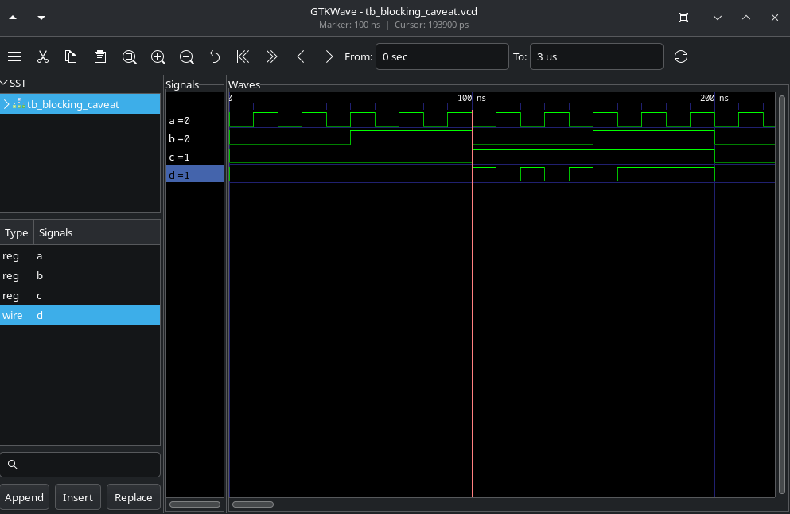
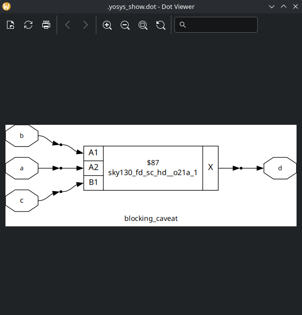
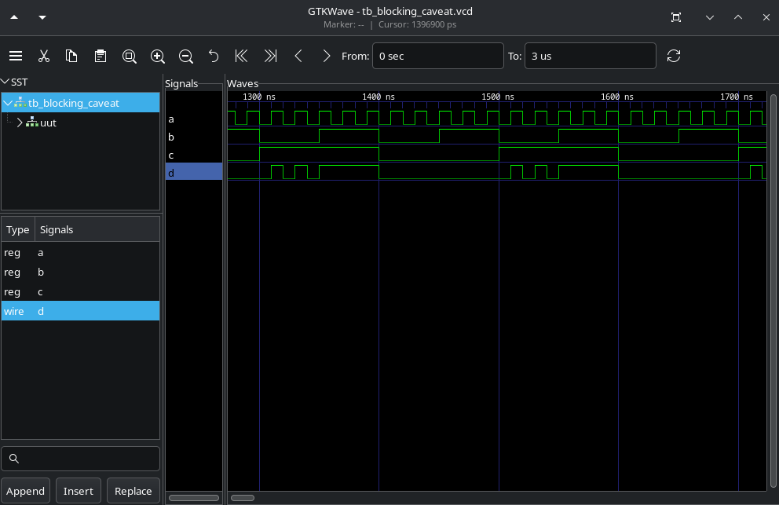

# Labs

# Lab11

In this lab, as there were no exercises, I repeated the examples from the class.

1.Simulate blocking_caveat.v.

2.Synth blocking_caveat.v.

3.Perform GLS simulation.

The simulation of the RTL returned a unwanted behavior (the output considers old values), while the GLS simualtion returned a expected result. This is another example of Synth-Sim mismatch.