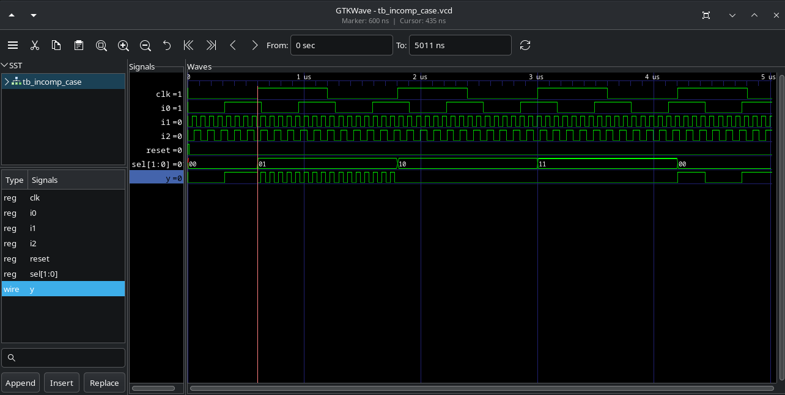
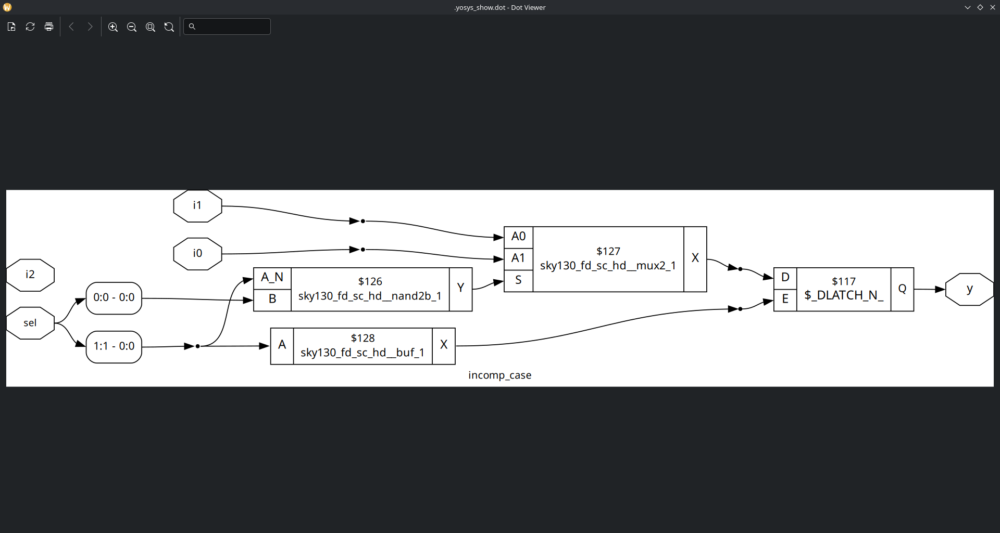
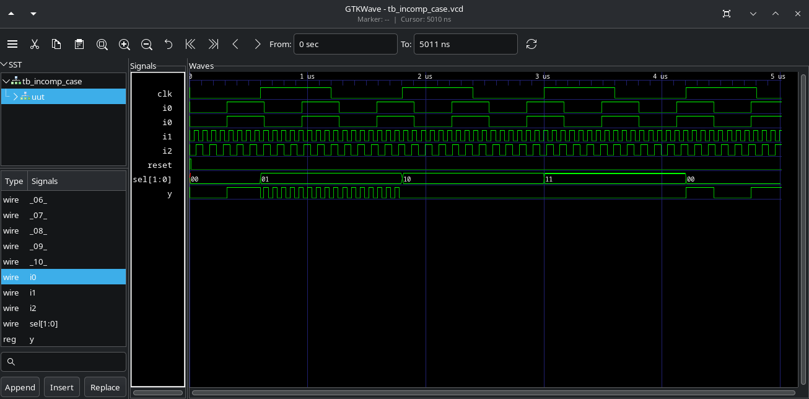
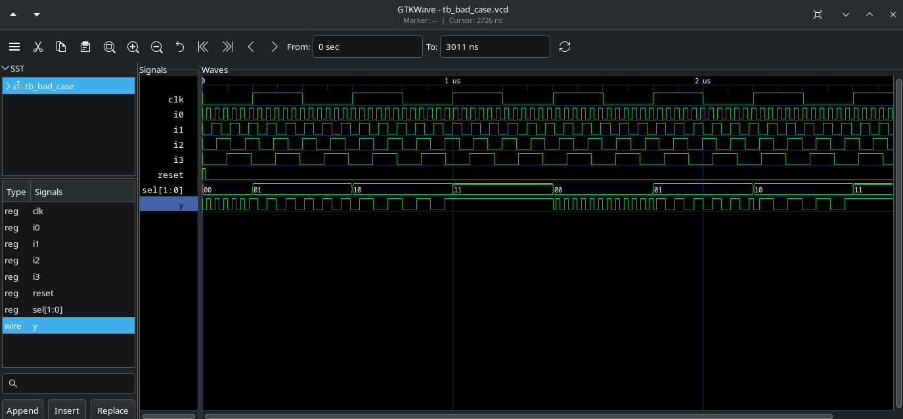
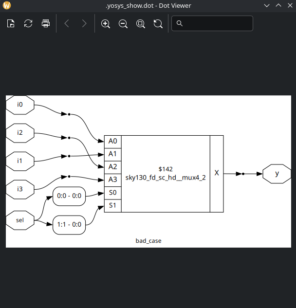
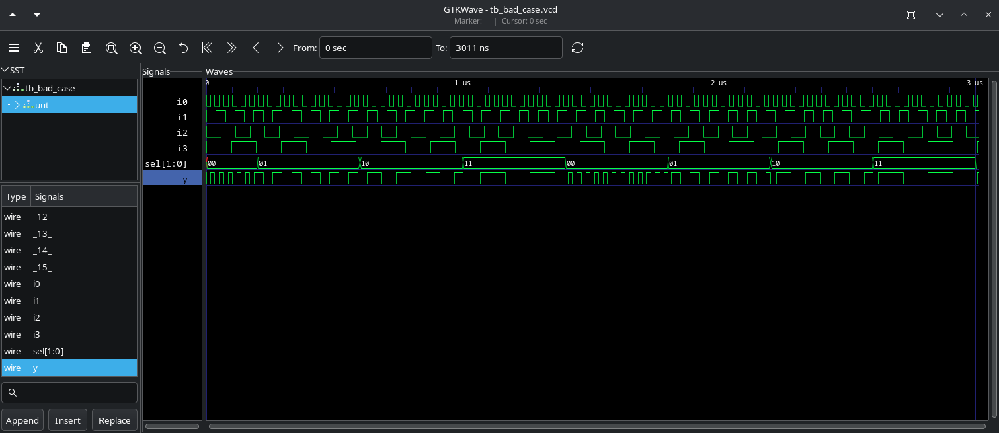

# Labs

## Lab 13

1. Simulate incomp_case.v

Latch behavior in the output (for sel equal 10 or 11).

2. Synth incomp_case.v

As expected, a latch has created, but the lib doesn't have a latch cell.

3. GLS sim of incomp_case_net.v

Same behavior as RTL sim.

=====================================

4. Simulate bad_case.v

Latch behavior in the output for sel equal to 11.

5. Synth bad_case.v

The synth tool inferred a 4x1 mux.

6. GLS sim of bad_case.v

Despite the bad code, the synthesis tool created the circuit correctly.
