# Labs

# Lab 14

1. sim mux_generate.v

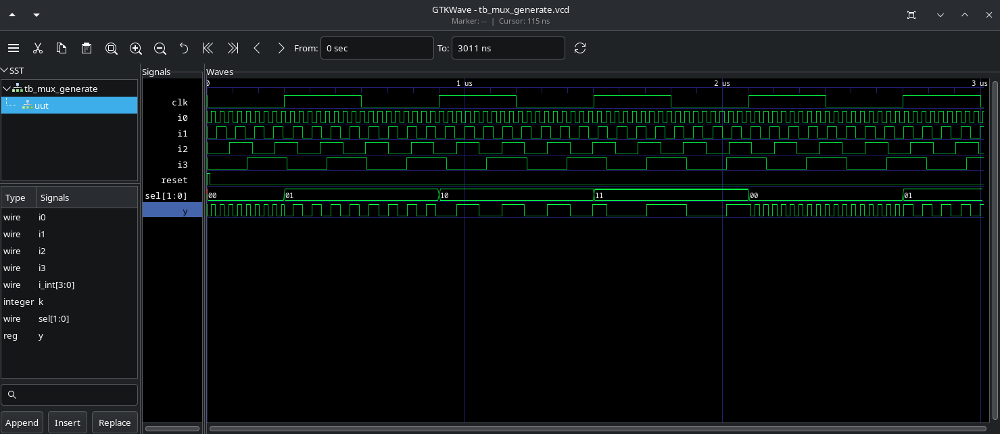

2. Synth and GLS sim mux_generate (exc)

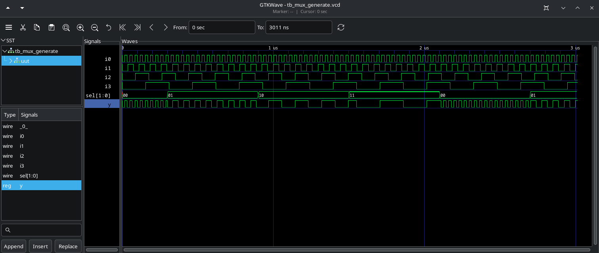

==================================

3. sim demux_case.v

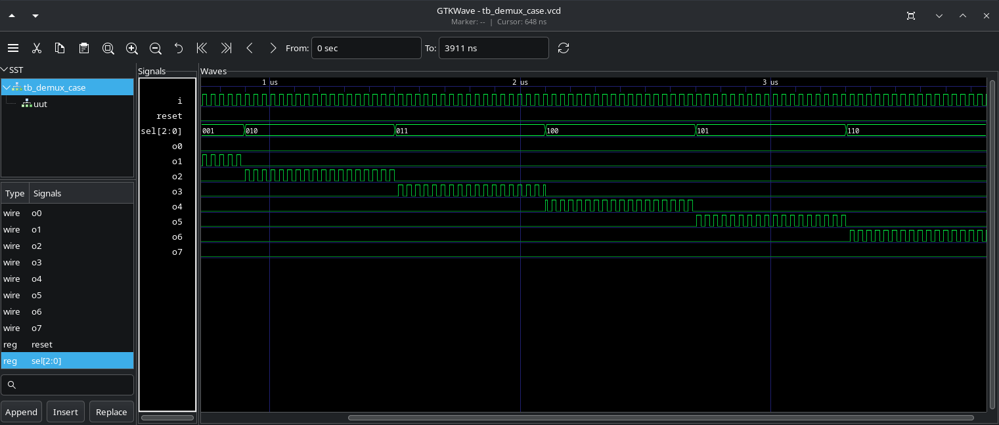

4. Synth and GLS sim (exc)

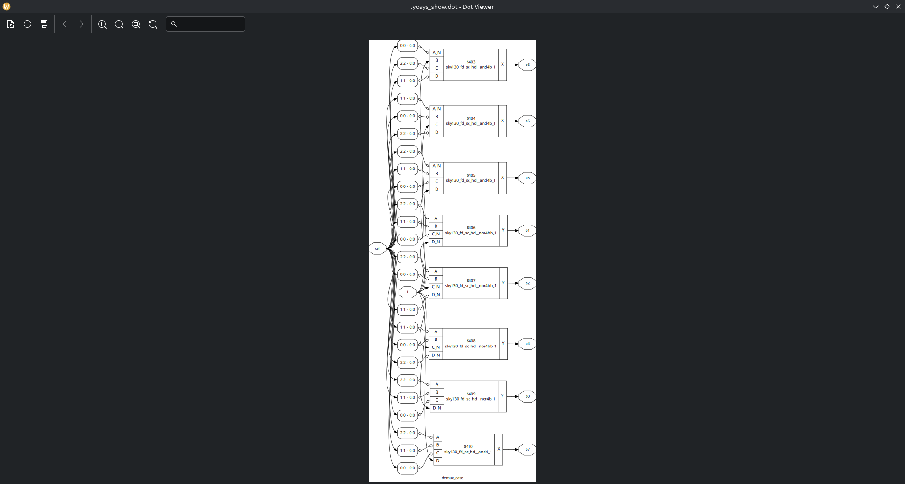

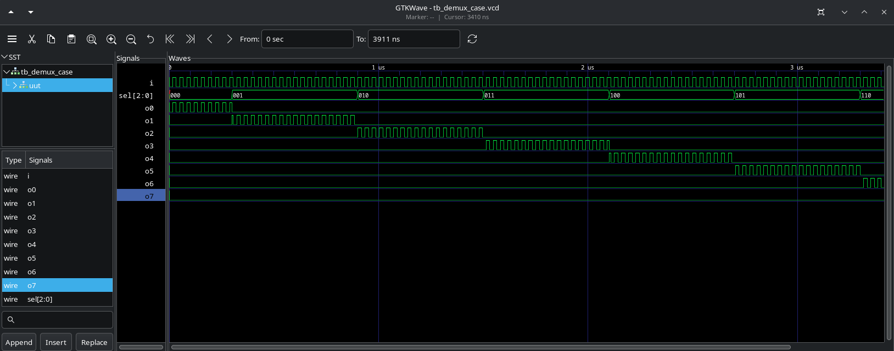

==================================

5. sim demux_generate.v

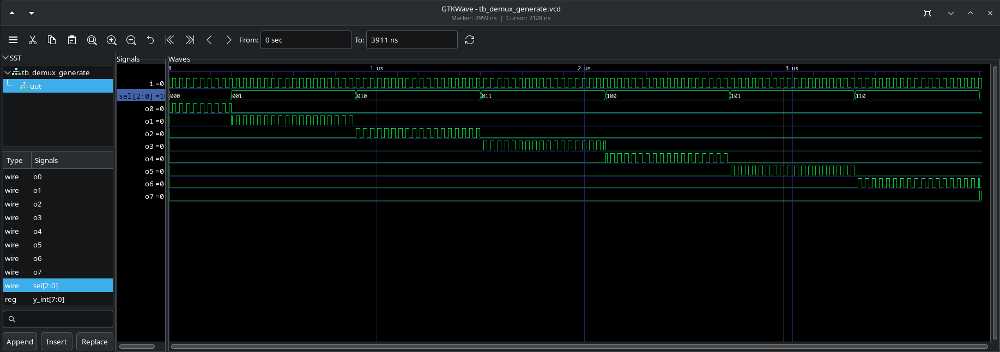

6. Synth and GLS sim (exc)

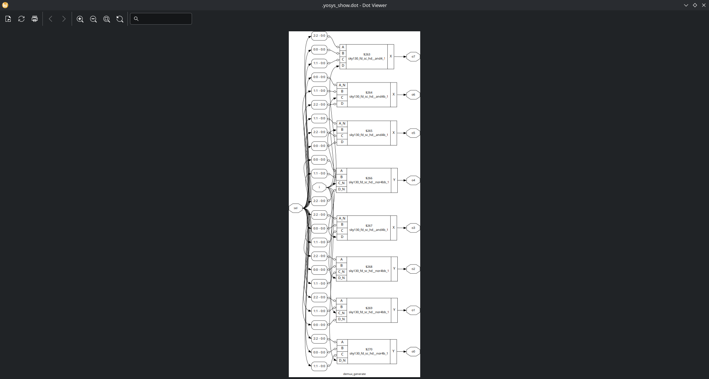

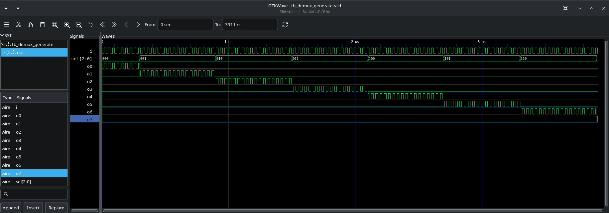

==================================

7. sim rca.v (include fa.v)

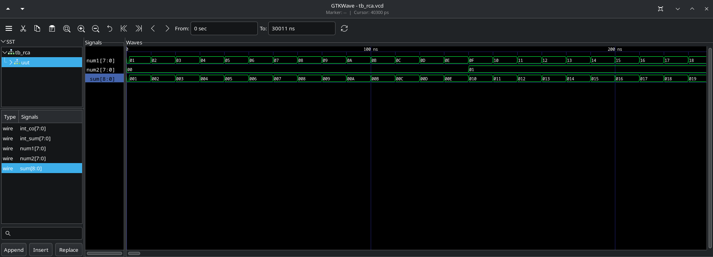

8. Synth and GLS sim (exc)

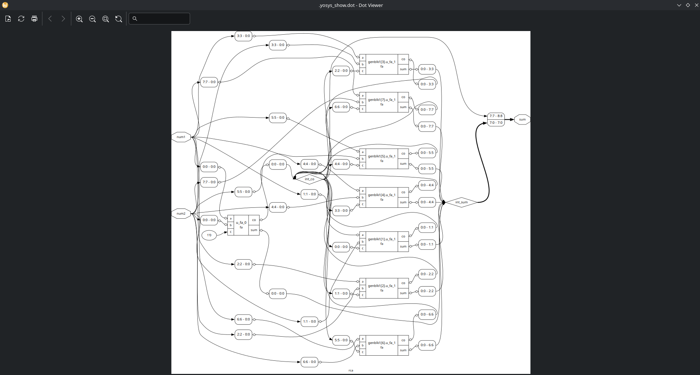

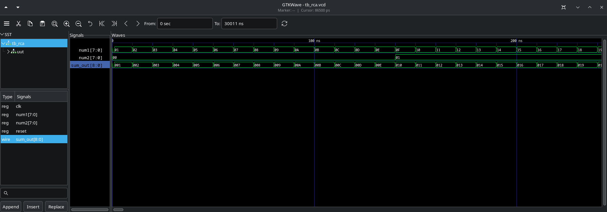
