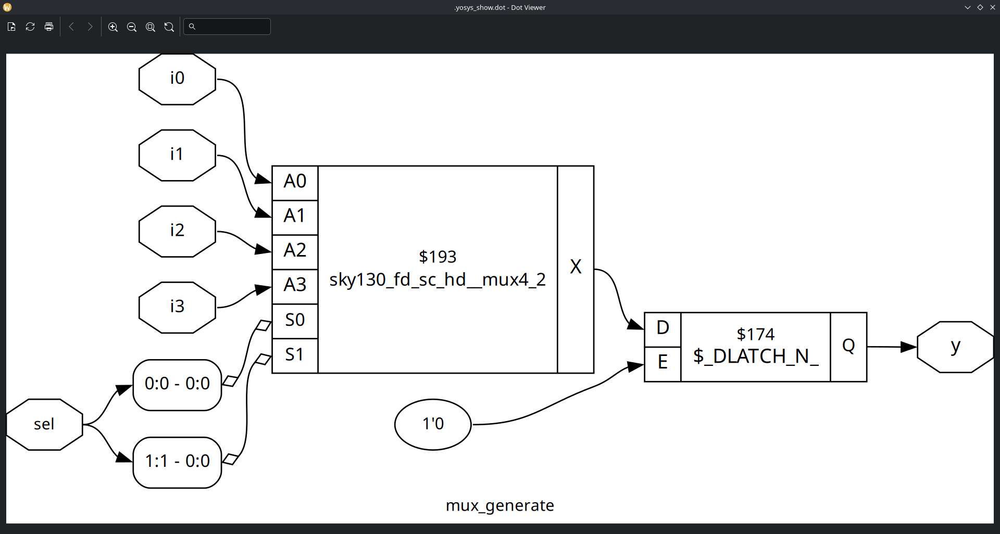

# Labs

# Lab 14

1. sim mux_generate.v

2. Synth and GLS sim mux_generate (exc)

==================================

3. sim demux_case.v

4. Synth and GLS sim (exc)

==================================

5. sim demux_generate.v

6. Synth and GLS sim (exc)

==================================

7. sim rca.v (include fa.v)

8. Synth and GLS sim (exc)

